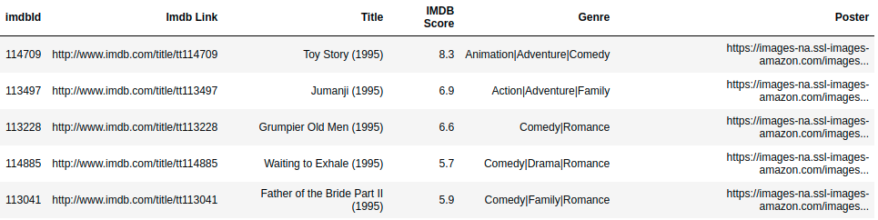

# Desafio Estagiário - Frontend

O objetivo geral do desafio é validar os conhecimentos básicos de Programação Web com foco no FrontEnd. Serão avaliados os conhecimentos de HTML+CSS, GIT e Design Patterns.

## Problema

Precisamos criar um catálogo online de filmes. Nesse catálogo web deve ser possível visualizar as informações básicas dos filmes em uma listagem e realizar buscas para filtrar a informação. 

O catálogo deve ser o mais organizado possível para facilitar a visualização e busca pelo usuário.

### Atividades

* Criar uma página web capaz de listar os filmes da base de dados
* Criar a funcionalidade de busca para filtrar a informação listada
* Publicar o código no [GitHub](http://github.com) 
* Publicar o sistema no [Heroku](https://www.heroku.com/)

## Dados 

O Kaggle disponibiliza uma base de dados que pode ser utilizada na solução do problema:

*  https://www.kaggle.com/neha1703/movie-genre-from-its-poster

## FAQ

#### Posso usar qualquer linguagem/framework?

Sim. Desde que seja web pode usar qualquer linguagem/framework para realizar o desafio. 

### Posso utilizar um template pronto e adaptar para a solução?

Sim.

#### Posso utilizar mais de uma base de dados para o problema?

Sim. A base apresentada é uma sugestão, caso julgue necessário pode utilizar qualquer outra base de dados que esteja disponível na internet.

